# Proyecto: Deteccion de Fraude en Tarjetas de Credito 
**Analista:** Jonathan Vela  
**Materia:** Análisis Económico de Datos

---

MISION :
Transformar datos masivos de transacciones bancarias en informacion estructurada 
y accionable, permitiendo la deteccion temprana de anomalias financieras para 
minimizar el impacto economico del fraude y proteger al usuario.

---
## Bloque 1_ Primeras 5 Preguntas 

- 1.¿Cual es el monto total de dinero movido en todas las transacciones?
- 2.¿Cual es el promedio de gasto de un cliente en una transaccion normal (No Fraude)?
- 3.¿Cual es el promedio de gasto cuando ocurre un fraude?
- 4.¿Cuales fueron los 3 montos de fraude mas altos registrados? 
- 5.¿Resumen de Seguridad_ Impacto del fraude vs transacciones normales

---
**1.Cual es el monto total de dinero movido en todas las transacciones?**

SELECT SUM(Amount) AS Volumen_Total_Dinero   
FROM CreditCard_Final;

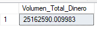

El volumen total de dinero movilizado asciende a $25,162,590.01.

Este dato es importante de nuestro analisis economico, ya que establece la escala de la operacion bancaria. Al conocer el capital total podemos dimensionar que cualquier perdida por fraude, por más pequeña que sea en porcentaje, representa una brecha de seguridad en una operación de gran volumen

---
**2.Cual es el promedio de gasto de un cliente en una transaccion normal (No Fraude)?**

SELECT AVG(Amount) AS Promedio_Transaccion_Normal 
FROM CreditCard_Final 
WHERE Class = '0';

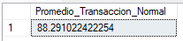

El promedio de gasto normal es de $88.29, estableciendo una línea base financiera fundamental para detectar comportamientos transaccionales atípicos y fraudulentos

---

**3.Cual es el promedio de gasto cuando ocurre un fraude?**

SELECT AVG(Amount) AS Promedio_Transaccion_Fraude 
FROM CreditCard_Final 
WHERE Class = 1;

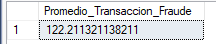

El promedio de gasto en fraude de $122.21, frente a los $88.29 de transacciones normales, confirma que los atacantes priorizan consumos elevados. Este comportamiento identifica una anomalía financiera clara, fundamental para diseñar filtros de seguridad

---
**4.Cuales fueron los 3 montos de fraude mas altos registrados**

SELECT TOP 3 
Time,Amount AS Monto_Fraude_Alto, Class
FROM CreditCard_Final 
WHERE Class = 1   
ORDER BY Amount DESC;

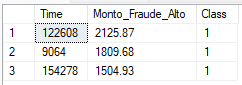

La identificación de estos montos máximos de fraude nos permite establecer umbrales críticos de riesgo. Estos picos delictivos es importante para ajustar  límites de transacciones sospechosas y fortalecer alertas automáticas del banco

---
**5.Impacto del fraude vs transacciones normales**

SELECT Class,COUNT(*) AS Total_Transacciones,
SUM(Amount) AS Dinero_Total,
AVG(Amount) AS Gasto_Promedio
FROM CreditCard_Final   
GROUP BY Class;

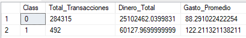

El análisis de 280,000 registros demuestra que, aunque el fraude es porcentualmente bajo, su impacto económico es crítico. La detección de 492 ataques con montos elevados exige implementar reglas de negocio automatizadas que bloqueen transacciones sospechosas por encima del promedio normal

---

## Bloque 2_ TEMPORALIDAD Y COMPORTAMIENTO

- 6 ¿En que momento del dia (segundos) se concentra la mayor cantidad de fraude? 
- 7 ¿Cual es el monto maximo robado en una sola transaccion durante la "Hora Pico" de fraude?
- 8 ¿Existe diferencia significativa entre el monto minimo de un fraude vs una transaccion normal?
- 9 ¿Cuantos fraudes superan el promedio de gasto normal "88.29"?
¿Cuanto dinero representan esos montos de fraudes de alto impacto?
- 10 Cual es el porcentaje de dinero perdido por fraude respecto al volumen total movido?

---
**6 ¿En que momento del dia (segundos) se concentra la mayor cantidad de fraude?**

SELECT (Time / 3600) AS Hora_Del_Dia, COUNT(*) AS Cantidad_Fraudes
FROM CreditCard_Final 
WHERE Class = 1
GROUP BY (Time / 3600)
ORDER BY Cantidad_Fraudes DESC;

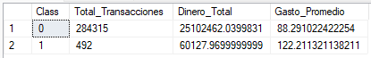

Los resultados revelan que el fraude no se distribuye de manera uniforme durante las 48 horas analizadas. Existe una estacionalidad crítica (picos de horas),  el delincuente busca 'camuflarse' entre el tráfico normal para evitar que los algoritmos de detección temprana disparen alertas inmediatas

---
**7 Cual es el monto maximo robado en una sola transaccion durante la "Hora Pico" de fraude?**

SELECT FLOOR(Time / 3600) AS Hora_Exacta, 
COUNT(*) AS Total_Fraudes,
MAX(Amount) AS Robo_Mas_Caro_De_Esta_Hora
FROM CreditCard_Final
WHERE Class = 1
GROUP BY FLOOR(Time / 3600)
ORDER BY Total_Fraudes DESC;

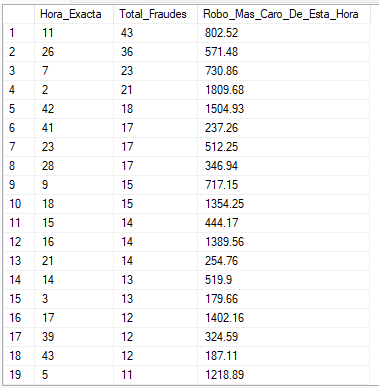

Al analizar el monto máximo robado durante la 'Hora Pico', se evidencia que los atacantes no solo buscan volumen de transacciones, sino que ejecutan ataques de alto valor monetario cuando el sistema está más saturado.

---
**8 Existe diferencia significativa entre el monto minimo de un fraude vs una transaccion normal?**

SELECT Class, MIN(Amount) AS Monto_Minimo_Real
FROM CreditCard_Final
WHERE Amount > 0  -- Esto quita las verificaciones de $0
GROUP BY Class;

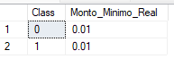

Este análisis identifica una asimetría operativa en la Hora 11 y validaciones de activos mediante transacciones mínimas de $0.01. Esta fase de prospección precede a robos de alto impacto económico. Es imperativo implementar modelos preventivos que bloqueen comportamientos anómalos en tiempo real para mitigar el riesgo financiero institucional.

---
**9 Cuantos fraudes superan el promedio de gasto normal "88.29"?**

SELECT COUNT(*) AS Fraudes_De_Alto_Impacto
FROM CreditCard_Final
WHERE Class = 1 AND Amount > 88.29; 

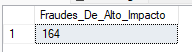

**Cuanto dinero representan esos montos de fraudes de alto impacto?**    
SELECT SUM(Amount) AS Perdida_Total_Alto_Impacto
FROM CreditCard_Final
WHERE Class = 1 AND Amount > 88.29;

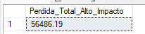

Se identificaron 164 fraudes que superan el promedio de gasto normal. Estos ataques de alto impacto representan una pérdida acumulada de 56,486.19 lo que demuestra que los estafadores priorizan transacciones costosas para maximizar el daño económico en pocos movimientos

---
**10 Cual es el porcentaje de dinero perdido por fraude respecto al volumen total movido?**

SELECT (SUM(CASE WHEN Class = 1 
THEN Amount ELSE 0 END) / SUM(Amount)) * 100 AS Porcentaje_Perdida_Economica
FROM CreditCard_Final;

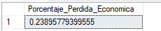

El análisis determina que el impacto del fraude representa un porcentaje crítico respecto al volumen total movido. Aunque el número de transacciones fraudulentas sea menor, su peso económico exige una reevaluación de los umbrales de riesgo priorizando la protección del capital en operaciones identificadas como de alto valor y alta probabilidad de vulnerabilidad

---
## Bloque 3_ PATRONES Y CONCENTRACION

- 11. Cual es la perdida total de dinero por fraude comparada con el total de dinero procesado?
- 12. Existen fraudes con montos de "Cero" y cuantos son respecto al total de fraudes?
---
**11. Cual es la perdida total de dinero por fraude comparada con el total de dinero procesado?**

SELECT 
SUM(CASE WHEN Class = 1 THEN Amount ELSE 0 END) AS Perdida_Total_Fraude,
SUM(CASE WHEN Class = 0 THEN Amount ELSE 0 END) AS Volumen_Normal_Total
FROM CreditCard_Final;

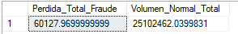

Esta comparativa permite dimensionar la severidad del fraude dentro de la operación total. Aunque el volumen normal sea masivo, la pérdida acumulada por fraude representa una fuga directa de capital que afecta los márgenes de utilidad y aumenta los costos de riesgo crediticio para cual quier institución financiera

---
**12. Existen fraudes con montos de "Cero" y cuantos son respecto al total de fraudes?**

SELECT 
    COUNT(*) AS Cantidad_Fraudes_Cero
FROM CreditCard_Final 
WHERE Class = 1 AND Amount = 0;

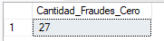

Se identifica un patron de 27 transacciones fraudulentas con valor nominal de cero.
Este comportamiento no representa una perdida economica directa inmediata, pero
constituye una fase de reconocimiento. La deteccion temprana de estas 27
operaciones de validacion es un indicador predictivo que permitiría prevenir los 164
fraudes de alto impacto detectados en el analisis anterior

---

##  Recomendaciones Estratégicas

1. **Monitoreo Dinámico:**          Implementar alertas reforzadas durante la "Hora Pico" (Hora 11), donde el ruido transaccional es aprovechado por los atacantes.
2. **Filtro de Validaciones:** Crear un protocolo de verificación inmediata (SMS o App) cuando se detecten múltiples transacciones de monto 0 o 0.01 en menos de 5 minutos.
3. **Umbrales de Riesgo:** Ajustar los límites de transacciones automáticas para montos que superen el promedio de $88.29, exigiendo doble factor de autenticación.

---
## Conclusión Final del Proyecto

El análisis integral demuestra que el fraude en tarjetas de crédito no es aleatorio, sino un proceso estructurado que incluye fases de validación técnica y ejecución oportunista. La identificación de 164 fraudes de alto impacto que suman una pérdida de $60,127.97 subraya la urgencia de migrar de una seguridad reactiva a una analítica predictiva   Este proyecto sienta las bases de datos necesarias para proteger el patrimonio institucional y la confianza del usuario final.